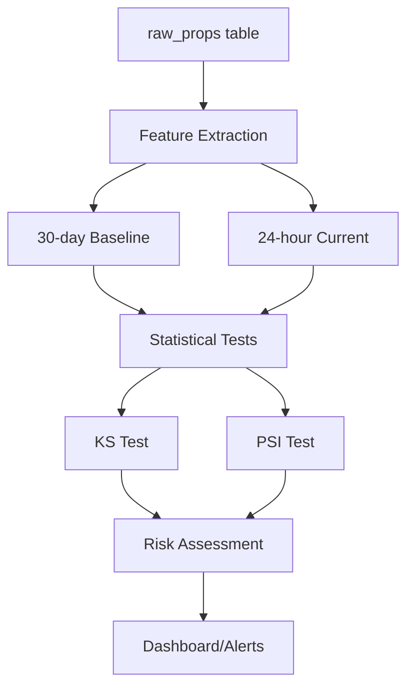

# Feature/Label Drift Detection System

## Overview

The drift detection system monitors changes in feature distributions in the `raw_props` table to detect when the underlying data patterns shift over time. This is critical for maintaining model performance and data quality in production.

## Statistical Methods

### Kolmogorov-Smirnov (KS) Test
- **Purpose**: Detects distribution drift between baseline and current data
- **Method**: Non-parametric test comparing empirical cumulative distribution functions
- **Output**: D-statistic (0-1) and p-value
- **Interpretation**:
  - D < 0.1: No significant drift
  - 0.1 ≤ D < 0.2: Warning level drift
  - D ≥ 0.2: Alert level drift

### Population Stability Index (PSI)
- **Purpose**: Measures population stability between distributions
- **Method**: Compares bin percentages between baseline and current data
- **Formula**: PSI = Σ (Actual% - Expected%) × ln(Actual% / Expected%)
- **Interpretation**:
  - PSI < 0.1: Stable population
  - 0.1 ≤ PSI < 0.2: Minor population shift
  - PSI ≥ 0.2: Major population shift

## Architecture

### Core Components

1. **Statistical Engine** (`scripts/ops/drift.ts`)
   - KS test implementation
   - PSI calculation
   - Feature extraction from JSONB data
   - Rolling baseline computation

2. **Configuration** (`scripts/ops/drift-config.json`)
   - Configurable thresholds for WARN/ALERT levels
   - Environment-specific settings
   - Feature categorization
   - Alerting configuration

3. **Integration Layer**
   - Ops system integration (`ops-all.ts`)
   - Dashboard reporting
   - Acceptance testing framework

### Data Flow



## Usage

### Manual Execution
```bash
# Run drift detection standalone
npm run ops:drift

# Run as part of ops suite
npm run ops:all

# Run acceptance tests
npm run acceptance:drift
```

### Automated Execution
The drift detection is automatically included in the comprehensive ops validation suite and runs whenever `ops:all` is executed.

## Configuration

### Basic Configuration (`drift-config.json`)

```json
{
  "ks_test": {
    "warn_threshold": 0.1,
    "alert_threshold": 0.2,
    "min_p_value": 0.05
  },
  "psi": {
    "warn_threshold": 0.1,
    "alert_threshold": 0.2,
    "bins": 10
  },
  "baseline": {
    "days": 30,
    "min_samples": 100
  },
  "features": {
    "min_frequency": 0.1,
    "max_features": 50
  }
}
```

### Environment-Specific Settings
- **Production**: More sensitive thresholds (0.08/0.15)
- **Staging**: More relaxed thresholds (0.12/0.25)
- **Development**: Uses default settings

### Feature Categories
- **Critical Features**: Core system features that must be stable
- **Business Features**: Domain-specific features with business impact
- **Technical Features**: Infrastructure features for monitoring

## Output Format

### Drift Analysis Result (`out/ops/drift.json`)

```json
{
  "timestamp": "2025-01-23T10:30:00Z",
  "analysis_window": {
    "baseline_start": "2024-12-24T10:30:00Z",
    "baseline_end": "2025-01-23T10:30:00Z",
    "current_start": "2025-01-22T10:30:00Z",
    "current_end": "2025-01-23T10:30:00Z"
  },
  "sample_sizes": {
    "baseline_count": 15420,
    "current_count": 312
  },
  "features": [
    {
      "name": "data.confidence",
      "frequency_baseline": 0.85,
      "frequency_current": 0.78,
      "ks_test": {
        "d_statistic": 0.045,
        "p_value": 0.23,
        "significant": false,
        "interpretation": "no_drift"
      },
      "psi": {
        "score": 0.032,
        "interpretation": "stable",
        "alert_level": "no_drift"
      },
      "summary": {
        "drift_detected": false,
        "severity": "low",
        "recommendation": "No action required - feature distribution stable"
      }
    }
  ],
  "overall_summary": {
    "total_features_analyzed": 23,
    "features_with_drift": 0,
    "features_with_warnings": 2,
    "features_with_alerts": 0,
    "overall_risk_level": "low",
    "recommendations": [
      "2 features show potential drift - increased monitoring recommended"
    ]
  }
}
```

### Dashboard Integration

The drift detection integrates with the operational dashboard at `out/ops/dashboard.json`:

```json
{
  "components": {
    "drift": {
      "ok": true,
      "risk_level": "low",
      "features_analyzed": 23,
      "features_with_alerts": 0,
      "features_with_warnings": 2,
      "drift_score": 0.087
    }
  }
}
```

## Alerting and Monitoring

### Alert Levels
- **LOW**: All features stable, drift score < 0.1
- **MEDIUM**: Some features showing drift, requires monitoring
- **HIGH**: Significant drift detected, immediate investigation required

### Integration Points
- **Ops Dashboard**: Real-time status and metrics
- **Acceptance Tests**: Validates system functionality
- **CI/CD Pipeline**: Automated drift monitoring in deployment pipeline

### Breach Detection
Drift monitoring integrates with the breach detection system:
- **med severity**: Features with warnings or medium risk
- **high severity**: Features with alerts or high risk

## Implementation Details

### Feature Extraction Algorithm

1. **Recursive JSONB Analysis**: Traverses nested JSON structures
2. **Numeric Feature Detection**: Identifies all numeric values
3. **Array Handling**: Extracts array lengths and numeric elements
4. **Path Construction**: Creates hierarchical feature names (e.g., `data.confidence`, `metadata.score`)

### Statistical Robustness

- **Minimum Sample Requirements**: Baseline ≥100 samples, current ≥10 samples
- **Frequency Thresholds**: Features must appear in ≥10% of records
- **Bin Validation**: PSI uses 10 bins with overflow protection
- **P-value Correction**: KS test uses asymptotic distribution approximation

### Performance Optimizations

- **Feature Limitation**: Maximum 50 features analyzed per run
- **Efficient Queries**: Optimized SQL for baseline and current data retrieval
- **Caching Strategy**: Results cached for dashboard integration
- **Timeout Handling**: 3-minute timeout for statistical analysis

## Troubleshooting

### Common Issues

1. **Insufficient Data**
   - **Error**: "Insufficient baseline data: X < 100"
   - **Solution**: Ensure system has been running for 30+ days with processed data

2. **No Features Found**
   - **Error**: "No common features with sufficient frequency"
   - **Solution**: Check raw_props.data structure and feature extraction logic

3. **Configuration Errors**
   - **Error**: "Failed to load drift config"
   - **Solution**: Validate drift-config.json syntax and structure

4. **Database Connection Issues**
   - **Error**: "Failed to fetch baseline/current data"
   - **Solution**: Check database connectivity and table permissions

### Validation Commands

```bash
# Test statistical functions
npm run acceptance:drift

# Validate configuration
node -e "console.log(JSON.parse(require('fs').readFileSync('scripts/ops/drift-config.json')))"

# Check data availability
psql "$DATABASE_URL" -c "SELECT COUNT(*) FROM raw_props WHERE processed_at IS NOT NULL AND inserted_at >= NOW() - INTERVAL '30 days'"
```

## Development and Testing

### Unit Tests
The system includes comprehensive testing:
- Statistical function validation
- Configuration loading
- Feature extraction
- Integration testing

### Acceptance Criteria
- ≥80% acceptance test pass rate required
- All statistical functions must work correctly
- Configuration must load and validate
- Feature extraction must find features in sample data
- Integration with ops system must function

### Extension Points
- **Custom Statistical Tests**: Add new drift detection methods
- **Feature Engineering**: Implement domain-specific feature extractors
- **Alerting Channels**: Integrate with external monitoring systems
- **Visualization**: Add drift trend charts and distribution plots

## Security and Compliance

- **Data Privacy**: No sensitive data logged or cached
- **Access Control**: Uses service role for database access
- **Audit Trail**: All drift analysis results timestamped and retained
- **Configuration Management**: Centralized, version-controlled configuration

## Performance Metrics

- **Analysis Time**: ~30-120 seconds for full drift analysis
- **Memory Usage**: ~50MB for typical feature set
- **Storage**: ~1-5MB per drift analysis result
- **CPU**: Moderate usage during statistical computation

## Future Enhancements

1. **Real-time Drift Detection**: Stream processing for immediate alerts
2. **Advanced Statistics**: Implement additional drift detection methods
3. **Machine Learning**: Anomaly detection for complex drift patterns
4. **Visualization**: Interactive drift monitoring dashboards
5. **Automated Remediation**: Trigger retraining or data quality fixes